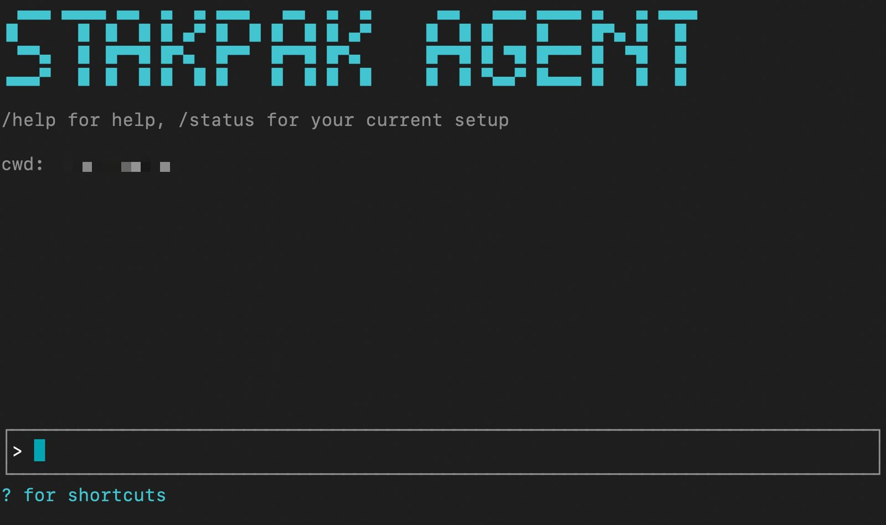
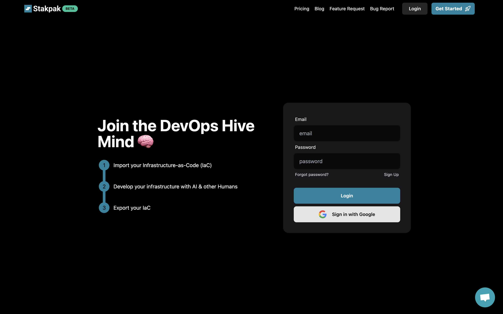
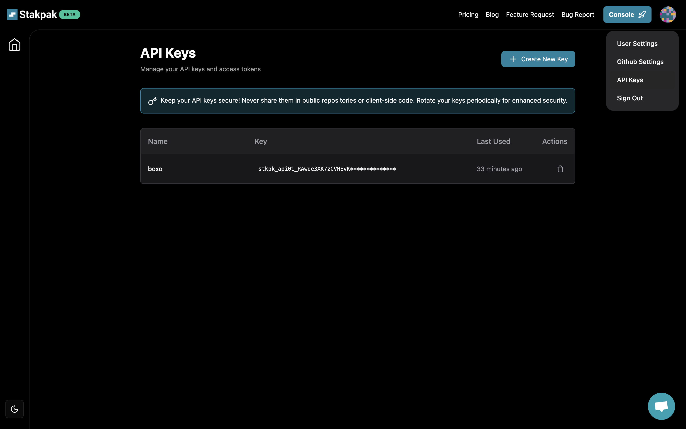
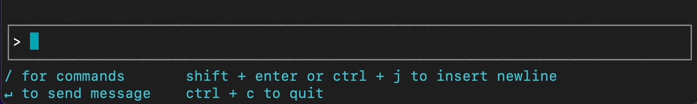

# Stakpak CLI

> **Warning**
> This CLI tool is under heavy development and breaking changes should be expected. Use with caution 🚧

A CLI for the Stakpak API. Manage all your DevOps flows and configurations in one place, with AI-agents helping you out.

## Installation

### Homebrew (macOS & Linux)

```bash
brew tap stakpak/stakpak
brew install stakpak
```

### Binary Release

Download the latest binary for your platform from our [GitHub Releases](https://github.com/stakpak/cli/releases).

### Docker

To run the CLI using Docker:

```bash
docker run -it ghcr.io/stakpak/cli:latest
```

## Usage

### Authentication

#### Create an API Key

1. Visit [stakpak.dev](https://stakpak.dev)
2. Click "Login" in the top right

   

3. Click "Create API Key" in the account menu

   

#### Set the environment variable `STAKPAK_API_KEY`

```bash
export STAKPAK_API_KEY=<mykey>
```

#### Save your API key to `~/.stakpak/config.toml`

```bash
stakpak login --api-key $STAKPAK_API_KEY
```

#### Start Stakpak
```bash
stakpak
```
#### Start from a saved checkpoint
```bash
stakpak -c <checkpoint-id>
```

#### View current account (Optional)

```bash
stakpak account
```

### Flow management

- List flows
- Get flow versions
- Clone configurations from a flow version
- Push configurations to a new flow
- Push configurations to an existing flow
- Perform LLM-powered queries on your configurations

### Agents

- List agent types
- List agent sessions and checkpoints
- Get agent checkpoint state
- Run agent
- Run agent form a specific checkpoint

## Keyboard Shortcuts


- Use `Arrow keys` or **Tab** to select options  
- Press `Esc` to exit the prompt
- `?` for Shortcuts  
- `/` for commands  
- `↵` to send message  
- `Shift + Enter` or `Ctrl + J` to insert newline  
- `Ctrl + C` to quit

